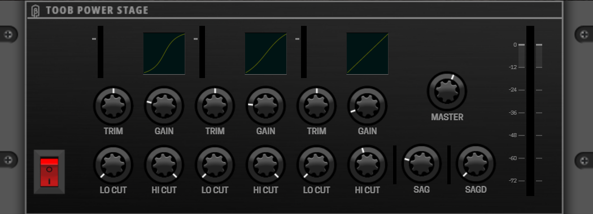
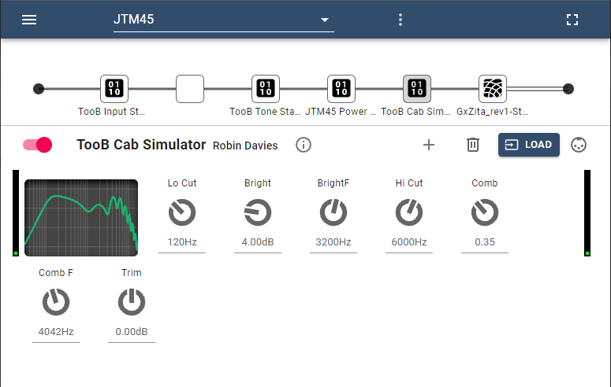

# ToobAmp LV2 Guitar Amp Plugins (v0.0.1 Alpha)

The ToobAmp LV2 are a port of a set of experimental Guitar Amp plugins that were originally written for Native Instruments Reaktor that have been ported to LV2 plugins. They currently have user interfaces for MODP, and for Pipedal only.

Distortion and overdrive effects in the plugs are based on super-sampled arctan waveshaping. The Toob Amp Power Section plugin provides three successive arctan wave shapers that provide a rich and suble range of tones and drive effects.

## The ToobAmp Input Stage

&nbsp;&nbsp;&nbsp;&nbsp;&nbsp;&nbsp;&nbsp;&nbsp;Fig. 1 Input Stage user interface in MODP

The ToobAmp Input Stage provides for trimming and shaping your guitar input signal.  A trim control to boost levels up to optimum level; low- and high-cut filters can be used to clean up input signals; a shelving filter can be used to emulate bright inputs; and a noise gate, and a boost waveshaper emulate overdriving of pre-amp input stages. 

## The ToobAmp Tone Stack

&nbsp;&nbsp;&nbsp;&nbsp;&nbsp;&nbsp;&nbsp;&nbsp;Fig. 2 Tone Stack user interface in MODP

The ToobAmp Tone Stack stage provides accurate emulation of either Fender Bassman or Marshall JCM-800 tone stacks.

## The ToobAmp Power Stage

&nbsp;&nbsp;&nbsp;&nbsp;&nbsp;&nbsp;&nbsp;&nbsp;Fig. 3 Power Stage user interface in MODP

The ToobAmp Power Amp stage provides three consecutive super-sampled arctan waveshapers to provide anything from clean warm guitar tones to blistering overdrive. Use the trim controls to boost input signals to each stage to something close to 0dB as indicated on the VU meters beside each drive stage. The SAG and SAGD controls provde emulation of transformer sag, based on advanced analysis of Fender Bassman circuitry. SAG controls how much sag occurs on the input signal level. SAGD controls how much sag occurs on the output signal. Both controls will provide compression; but judicious use of the SAG control will cause a more gentle breakup of guitar signals that makes the amp feel more "forgiving".; the SAGD provides some amount of compression on the output signal. Use both controls judiciously, as high settings of either control will produce a sound that sounds noticeably compressed. 

## The ToobAmp Cab Simulator

&nbsp;&nbsp;&nbsp;&nbsp;&nbsp;&nbsp;&nbsp;&nbsp;Fig. 4 Cab Sim user interface in Pipedal.

Rather than relying on expensive convolution effects, the Toob Amp Cab Emulator provides EQ controls that be can be used to match measured cabinet responses of real amps, or produce EQ settings to suit particular purposes without reference to actual cabinets responses. 

Fender cabinets tend to have 60 or 70Hz low-frequency cutoffs, with a relatively flat frequency response after that; Marshall amps tend to have a low-frequency cutoff at 120Hz, and slight shelving boost somewhere close to 2khz. 

The comb filter is used to emulate open-back speakers, which cause comb filtering effects in high-frequency ranges due to reflections off the wall behind the cabinet.  The ripples in the high frequecny response give final guitar tone a bit of "sparkle" that can be quite attractive. Set the comb filter frequency to somewhere between 1500 and 2000kHz, and adjust the depth to suit your personal taste.

## Building ToobAmp

Prerequisites:

	`apt install libboost-all-dev lv2-dev`
	
If you have not installed Visual Studio Code, you will need to install CMake:

	`apt install cmake`

ToobAmp was built using Visual Studio Code, with CMake build files. If you load the ToobAmp directory in Visual Studio code, Code will automatically configure and build the project 

After a full build, in Visual Studio code, run the following command to install ToobAmp:

	`sudo ./install`
	
If you are not usings Visual Studio Code, the following shell scripts, found in the root of the project, can be used to configure, build and instal the project:

    ``./config     #configure the proejct`
   
    `./bld   # build the project.
    
    `sudo ./install`
   
